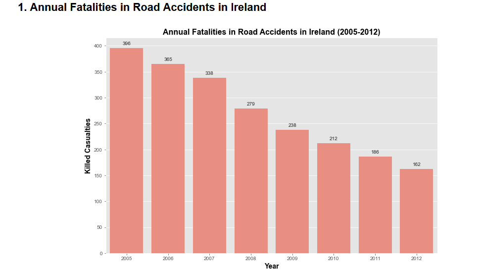
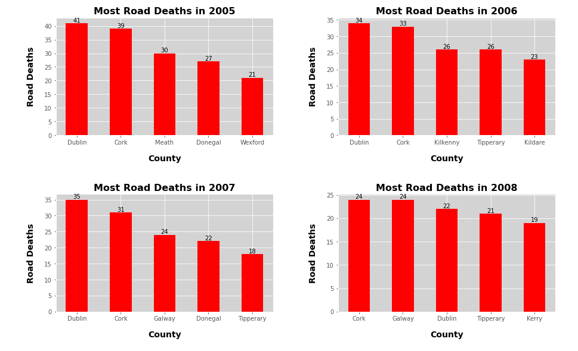
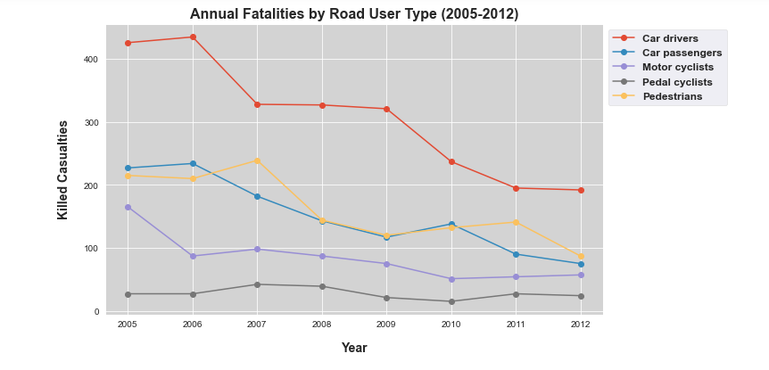
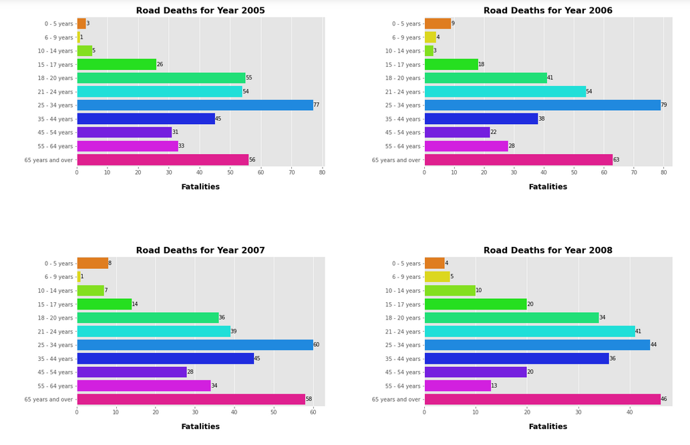
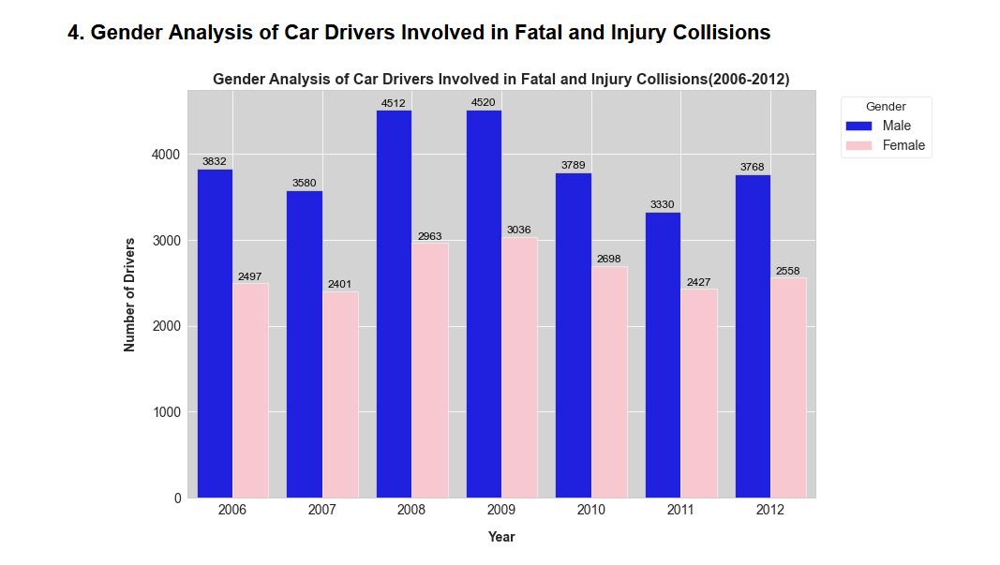
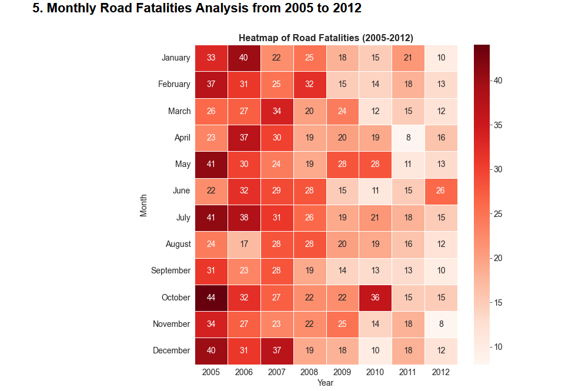

# Data Analytics Project-Ireland Road Accidents Analysis

## 1. Problem Definition
In this project, we are exploring the dataset that includes **Road Accident data in Ireland from 2005 to 2012**. The objective is to analyze and visualize data to discover trends and insights related to road fatalities and injuries. 

## 2. Dataset

The original datasets were sourced from the **Central Statistics Office website** at this link:
http://www.cso.ie/px/pxeirestat/Database/eirestat/Road%20Safety%20Statistics/Road%20Safety%20Statistics_statbank.asp?SP=Road%20Safety%20Statistics&Planguage=0&ProductID=DB_RSA

The website provides a collection of datasets related to various groups involved in road accidents. An interactive interface on the website allows the selection of specific years and categories (such as gender, injury, or fatal casualties) to tailor the data output. For this project, The excel file was downloaded to be used for analysis. **The years in the data are from 2005-2012**. 

## 3. Formatting in Microsoft Excel

After obtaining the dataset (Excel file), I used **Microsoft Excel to format, clean and optimise my data**. I had to reformat the cells and change **‘Year’** to an attribute in order to create a correct **‘Measure’** data to analyse. My new file is **‘Road Accidents.xls’**.

## 3. Tools 

The primary tools used for this analysis are **Python** and its powerful libraries including **Pandas**, **Matplotlib** and **Seaborn** for **data cleaning**, **analysis**, and **Visualization**.

## 4. Analysis Performed

I focused on various aspects of the data, including:

1.  **Annual Fatalities in Road Accidents in Ireland**: This provides an overall count of fatalities due to road accidents on an annual basis in Ireland from 2005 to 2012. The count is aggregated for all user categories and counties, and it helps observe the trend of road fatalities over this time period.

   

 
2. **Irish Counties (Regions in Ireland) with the Highest and Lowest Road Fatalities among Road Users**: This part of the analysis identifies the counties in Ireland that have the highest and lowest counts of road fatalities. This can help in understanding regional differences and could be vital for policy implementation at a regional level.

   

3.  **Road User Category and Associated Fatalities**: In this analysis, road fatalities are broken down according to different road user categories such as drivers, passengers, pedestrians, and cyclists. This provides insights into which user group is most prone to fatal accidents, and can guide measures tailored to these specific groups.

  

4.  **Annual Casualty Counts by Age Group (2005-2012)**: This part of the analysis categorizes the casualties based on age groups, and counts them for each year from 2005 to 2012. This helps to identify which age groups are most affected by road accidents, and can help guide age-specific road safety campaigns.

5.  **Gender Analysis of Car Drivers Involved in Fatal and Injury Collisions**: This analysis focuses on the gender distribution among drivers who were involved in fatal and injury collisions. It helps to understand if there's a significant gender disparity in these occurrences and could inform gender-focused driving safety initiatives.

 

6.  **Monthly Road Fatalities Analysis**: This exploration uncovers patterns in road fatalities on a monthly basis. This can reveal whether certain months have higher fatalities, possibly due to factors such as weather conditions or holiday travel, and can help in scheduling public safety campaigns at appropriate times of the year.

## 5. Future Work

The current analysis provides substantial insights into road accidents data for the years 2005-2012. In the future, I plan to expand this analysis to include data from 2013 onwards, aiming to observe how patterns have evolved over time.

Additionally, the analysis could delve deeper into other factors present in the data such as weather conditions, type of vehicles involved, and the time of day when most accidents occur. This could provide further insights that might help in devising strategies to reduce road fatalities and injuries. 

The application of machine learning techniques to predict future road fatalities based on current trends could also be an interesting direction for future exploration.

